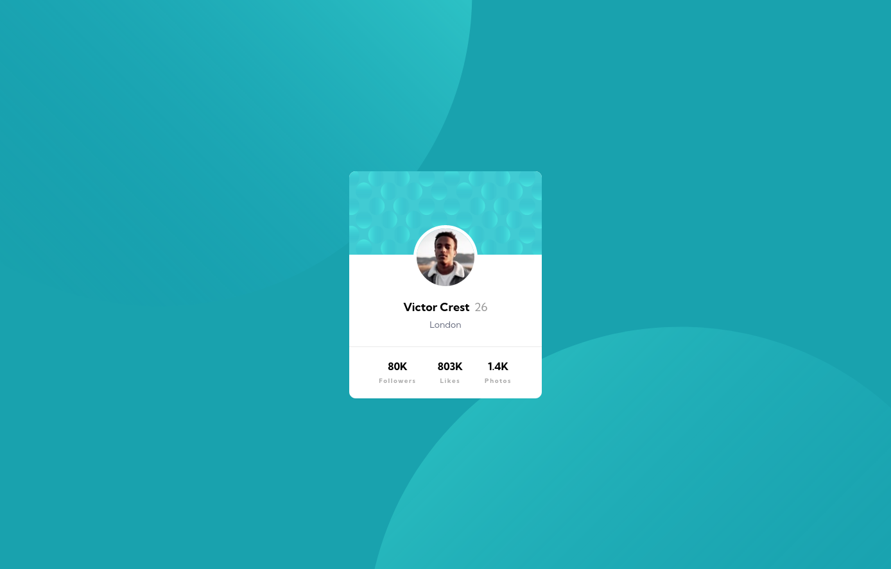

# Frontend Mentor - Profile card component solution

This is a solution to the [Profile card component challenge on Frontend Mentor](https://www.frontendmentor.io/challenges/profile-card-component-cfArpWshJ). Frontend Mentor challenges help you improve your coding skills by building realistic projects. 

## Table of contents

- [Overview](#overview)
  - [The challenge](#the-challenge)
  - [Screenshot](#screenshot)
  - [Links](#links)
- [My process](#my-process)
  - [Built with](#built-with)
  - [What I learned](#what-i-learned)
  - [Continued development](#continued-development)
  - [Useful resources](#useful-resources)
- [Author](#author)
- [Acknowledgments](#acknowledgments)

## Overview

### The challenge

- Build out the project to the designs provided

### Screenshot

### Links

- Solution URL: https://github.com/saira512dev/profile-card-component.git
- Live Site URL: https://objective-dijkstra-c3a897.netlify.app/

## My process

### Built with

- Semantic HTML5 markup
- CSS custom properties
- Flexbox
- Mobile-first workflow

### What I learned

I looked into how to position background images using percentage values first but later discovered that using vw and vh values is way more responsive and also learnt  to use multiple background images

## Author

- Website - (https://www.officialsaira.me)
- Frontend Mentor - (https://www.frontendmentor.io/profile/saira512dev)
- Twitter - (https://www.twitter.com/Devnewbie1)

